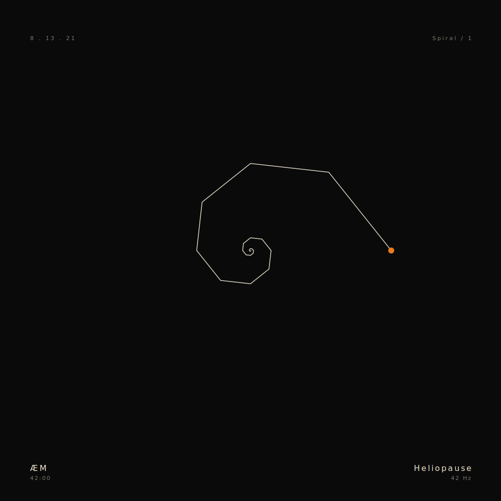
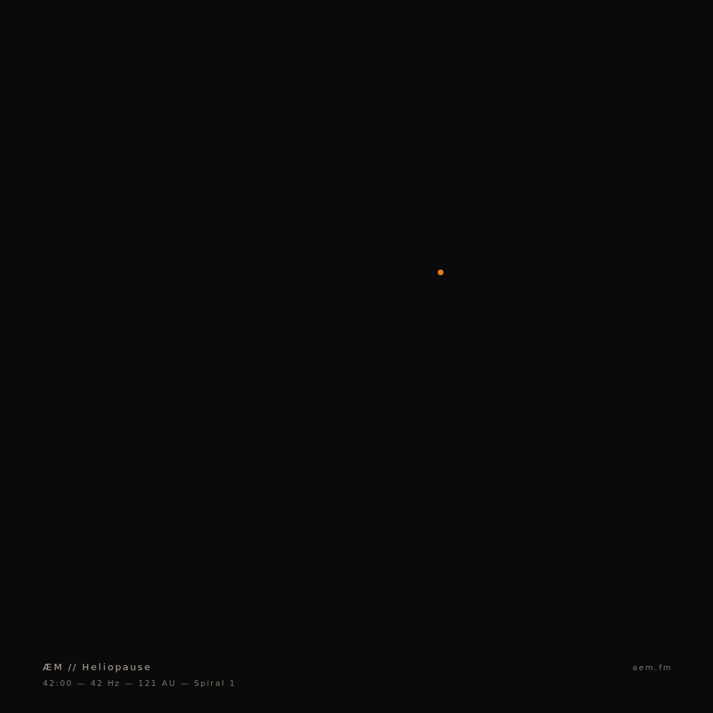
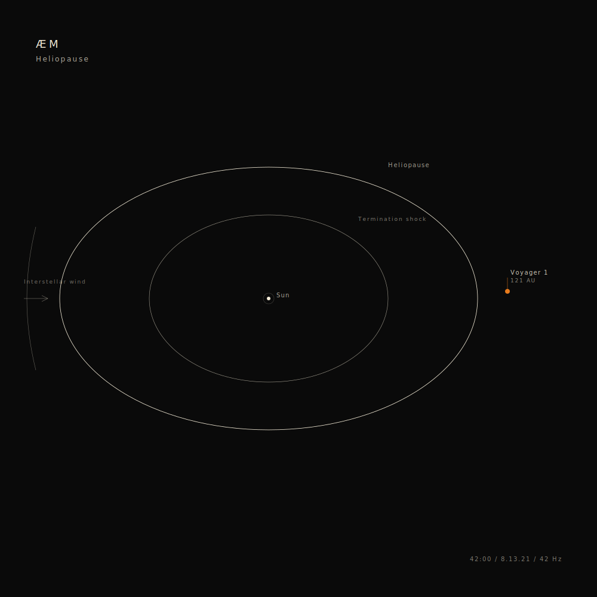
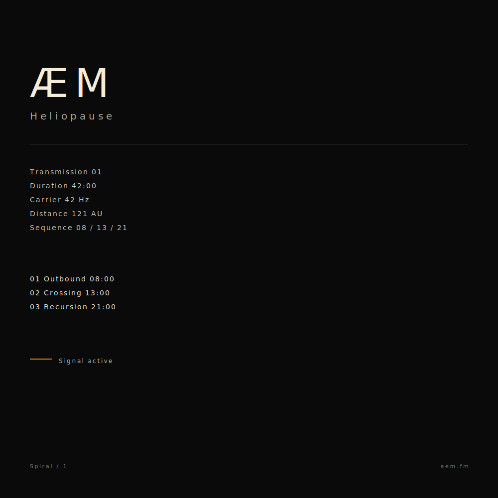
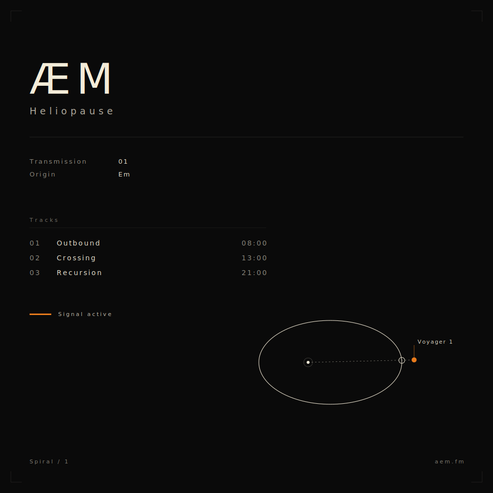

# Arte de tapa — 4 conceptos

Cuatro direcciones visuales para el EP *Heliopause*. Todas respetan las reglas del concepto: negro absoluto, blanco hueso, un solo acento (naranja Voyager #E87B1C), tipografía monoespaciada, geometría limpia, nada figurativo. Los SVGs están al lado de este markdown.

---

## Concepto A — Spiral

Una espiral logarítmica áurea, línea fina blanco hueso sobre negro absoluto. Un único punto naranja al final del recorrido — Voyager más allá de la heliopausa. Texto técnico minimal en las cuatro esquinas (ÆM, Heliopause, 8.13.21, 42:00, 42 Hz, Spiral / 1).

**Por qué funciona:** la espiral *es* la idea, capturada en una imagen única. Los datos en las esquinas son el guiño matemático sin nombrar el 42.

**Riesgo:** la espiral está sobreusada en imaginería esotérica. Hay que ejecutarla con mucha contención — línea finísima, mucho aire, cero adornos. Confiar en que el vacío hace el trabajo.

---

## Concepto B — Pale Point

Un único punto naranja chico, off-center (en proporción áurea), sobre un campo negro inmenso. Voyager 1 visto desde el origen. Texto en una sola línea al pie. Maximalismo invertido — casi toda la imagen es vacío.

**Por qué funciona:** evoca *Pale Blue Dot* de Sagan, pero invertido — somos nosotros mirando a la sonda, no la sonda mirándonos. La intensidad viene del vacío. Imposible de confundir con otra cosa. Es el gesto más cerca al de Steve Roach con *Structures From Silence*: un único elemento icónico, mucho aire negro.

**Riesgo:** al ojo distraído puede parecer que falla. Necesita escala grande (vinilo, impresión) para leerse bien. En thumbnail de Spotify pierde fuerza — habría que considerar una variante con el punto un poco más grande para feeds.

---

## Concepto C — Heliosphere Diagram

Diagrama científico de la heliósfera: Sol, choque de terminación, heliopausa, viento interestelar, Voyager 1 marcado más allá del límite. Estilo blueprint NASA, líneas finas blanco hueso, etiquetas en monoespaciada. Único toque de color: el punto Voyager naranja.

**Por qué funciona:** cero metáfora — es directamente un mapa científico. La estética técnica refuerza la promesa del proyecto ("la ciencia es la mística"). El "121 AU" se lee sin necesidad de explicar.

**Riesgo:** puede leerse como ilustración educativa, no como arte. La diferencia está en la composición, el peso del vacío negro, y la contención. Si se carga de etiquetas o se decora, falla.

---

## Concepto D — Data / Telemetría

Tapa hecha solo de texto. ÆM gigante en monoespaciada arriba. Bloque de datos tipo log de telemetría (transmission, duration, carrier, distance, sequence). Tracklist con duraciones. Una sola línea naranja de acento marcando "signal active". Brutalismo tipográfico.

**Por qué funciona:** la información *es* la imagen. La tapa funciona como una ficha técnica de la transmisión, refuerza el lore (no es música, es una grabación capturada). Muy distintivo en feeds visuales — destaca por *no* tener imagen.

**Riesgo:** depende 100% de la tipografía. Necesita una monoespaciada con personalidad (JetBrains Mono, Berkeley Mono, IBM Plex Mono). Si no está finamente ajustada, parece torpe.

---

## Mi voto

**B (Pale Point) o A (Spiral)** son los más fuertes y los más rápidos de producir bien. C necesita más ajuste fino para no parecer ilustración educativa. D es alto riesgo / alta recompensa — depende de la tipografía exacta.

Si tuviera que elegir uno solo: **B**. Es el más radical, el más memorable, y el que mejor honra el gesto de Steve Roach (*Structures From Silence*: un solo elemento icónico, mucho aire negro, profundidad por contraste). En vinilo o impresión grande es devastador. Para Spotify habría que producir una variante con el punto un poco más grande.

Pero **A** es más "legible" en feeds chicos y captura el concepto de la espiral más explícitamente, lo cual ayuda al storytelling del EP.

Decisión final: tuya.

---

## Concepto E — Hybrid (D + C, refinado) ★ ELEGIDO — v2

Combinación: layout tipográfico de D con un diagrama-logo de la heliósfera abajo a la derecha — sin etiquetar "Heliopause" en el gráfico, la frontera marcada con un nodo circular abierto sobre la elipse exterior, exactamente donde la trayectoria Sol → Voyager 1 la cruza. La forma es la palabra.

**Datos (izquierda arriba):**
- *Transmission 01* y *Origin Em* (sin Sequence — era redundante con el tracklist; sin Duration ni Carrier — son metadata visible al escuchar).
- *Origin Em* refuerza el lore: la sonda se llamaba Em antes del cruce, ÆM es lo que firma después.
- Etiquetas atenuadas (opacidad 0.55), valores en blanco hueso pleno (0.95) — jerarquía sin negritas.

**Tracklist:**
- Columnas separadas: número (atenuado) · título (fuerte) · duración (atenuado), alineadas en grilla.
- Header "Tracks" en gris suave con línea fina debajo.

**Signal active:**
- Línea naranja Voyager + texto, alineados verticalmente al x-height de la tipografía (no al baseline).

**Diagrama (esquina inferior derecha) — tratamiento de logo:**
- Heliopausa: una sola elipse, stroke 1.1 (peso de marca, no de bosquejo).
- Sol: punto + halo, offset a la izquierda (asimetría tipo cometa).
- Trayectoria punteada Sol → Voyager.
- Marca de heliopausa: círculo abierto ø12px (stroke 1.0) sobre la elipse, donde la trayectoria la cruza. Sin texto.
- Voyager 1: punto naranja 5px + leader vertical + label *Voyager 1* (font 11px, legible).
- Eliminados respecto a la versión anterior: choque de terminación, viento interestelar, label "121 AU", caption "Trajectory · spiral 1". Se buscó iconicidad sobre detalle.

**Padding:**
- Todo el contenido respeta margen lateral de 60px. El label de Voyager termina en x=919, con margen real al borde.

**Detalles de calidad:**
- Marcas de registro en las cuatro esquinas (proof impreso, peso de documento).
- Letter-spacing diferenciado por jerarquía.
- Pesos de línea consistentes.
- Opacidades estructuradas en niveles claros (0.95 / 0.85 / 0.55 / 0.45 / 0.22).

**Producción final:**
- Al committear, ajustar la fuente exacta (Berkeley Mono o JetBrains Mono), exportar a PNG 3000×3000 para Spotify/Bandcamp/Apple Music, 1500×1500 para SoundCloud, 1080×1080 cuadrado para Instagram.
- Variante para vinilo 10'': mismo layout, eventualmente sin marcas de registro si no se imprimen.

---

## Notas de producción

- **Color exacto del acento:** naranja Voyager #E87B1C (cálido, terroso, no neón). Alternativa: magenta de transmisión #D946EF si querés un giro más sintético.
- **Negro:** #0A0A0A (no negro absoluto puro #000000 — el #0A0A0A tiene más profundidad en pantalla).
- **Blanco:** #F4ECD8 (blanco hueso, ligeramente cálido — más "papel viejo" que "interfaz").
- **Tipografía monoespaciada recomendada:** Berkeley Mono (paga), JetBrains Mono (libre), IBM Plex Mono (libre), Space Mono (libre).
- **Formato final:** SVG para web, PNG 3000x3000 para Spotify/Bandcamp/Apple Music, PNG 1500x1500 para SoundCloud, JPG comprimido 1080x1080 para Instagram.
- Los SVGs actuales son bocetos a 1000x1000 — al committear, se ajustan proporciones, pesos de línea y kerning antes de exportar.
